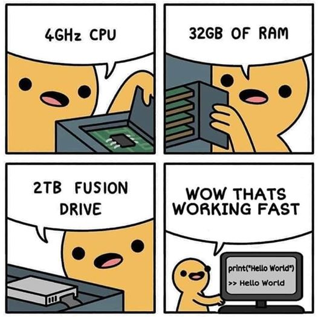

  

  <h3 align="center">HI THERE, I'M SIREN 👋</h3>

  

  <strong>
    😄 ᴘʀᴏɴᴏᴜɴs: ʜᴇ•ʜɪᴍ•ʜɪs |
    👨‍🎓 ᴍ.sᴄ ᴄs ɢʀᴀᴅᴜᴀᴛᴇ |
    🌃 ɴʏᴄᴛᴏᴘʜɪʟɪᴀ |
    🍵 ᴄᴀғғᴇɪɴᴇ ᴅᴇᴘᴇɴᴅᴇᴅ ʟɪғᴇ ғᴏʀᴍ |
    📚 ᴄᴏᴍᴍᴜɴɪᴛʏ ᴍᴀɴᴀɢᴇʀ ғᴏʀ sɪʟᴇɴᴛ ʟɪʙʀᴀʀʏ |
    🏫 ɪ'ᴍ ᴄᴜʀʀᴇɴᴛʟʏ ʟᴇᴀʀɴɪɴɢ ᴇᴠᴇʀʏᴛʜɪɴɢ ɪ ᴄᴀɴ 🤣
  </strong>

### **<u>💫 About Me:</u>**

Yo! I'm a chill software dev, vibing with the code to create some laid-back and efficient solutions. My journey in the programming realm started way back, and ever since, I've been riding the chill waves, exploring various tech and programming languages. Web dev, data analysis, even some machine learning – I'm all about those mellow challenges and soaking in the wisdom from each one. But you know what really puts me in the zone? Lofi beats, man. Nothing like coding to those soothing tunes. And when I'm not deep in code, catch me in a cozy gaming sesh, just kicking back and enjoying the chill vibes. Oh, and can't forget my love for coffee – it's like my coding fuel. And let's not leave out the furry friends; I'm all about the cats and dogs. Nothing beats a good coding session with a cup of coffee and some four-legged pals by my side. 

### **<u>🎭 Profile Views:</u>**

<!--  -->

### **<u>🌐 Socials</u>:**

### **<u>💻 Tech Stack:</u>**

<!--  -->

<!--  -->

<!--  -->

<!--  -->

<!--  -->

<!--  -->

<!--  -->

<!--  -->

<!--  -->

<!--  -->

<!--  -->

<!--  -->

<!--  -->

<!--  -->

<!--  -->

<!--  -->

<!--  -->

<!--  -->

<!--  -->

<!--  -->

<!--  -->

<!--  -->

<!--  -->

<!--  -->

<!--  -->

<!--  -->

<!--  -->

<!--  -->

<!--  -->

<!--  -->

<!--  -->

<!--  -->

<!--  -->

<!--  -->

<!--  -->

<!--  -->

<!--  -->

<!--  -->

<!--  -->

<!--  -->

<!--  -->

<!--  -->

### **<u>📊 GitHub Stats:</u>**

### **<u>🏆 GitHub Trophies:</u>**

### **<u>✍️ Random Dev Quote</u>**

### **<u>🔝 Top Contributed Repo</u>**

### **<u>😂 Dev Meme</u>**

  

 

  

