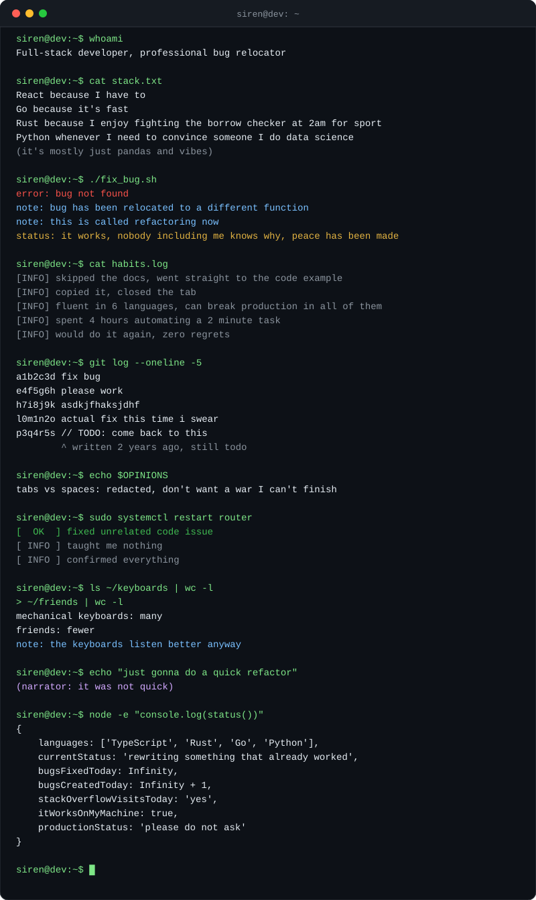

    
    <h1>
        Hey, I'm Siren 👋
    </h1>
    
     
    
    
    
    

<h2>
    
    About Me
</h2>

 
<h2>
    
    Tech Stack
</h2>
<table width="100%">
    <tr>
        <td valign="top" width="50%">
            <h3>Languages</h3>
            
            
            
            
            
            
            
            
            
        </td>
        <td valign="top" width="50%">
            <h3>Frontend</h3>
            
            
            
            
            
            
            
            
        </td>
    </tr>
    <tr>
        <td valign="top" width="50%">
            <h3>Backend & Runtimes</h3>
            
            
            
            
            
            
            
            
            
        </td>
        <td valign="top" width="50%">
            <h3>Data & AI/ML</h3>
            
            
            
            
            
            
            
            
            
        </td>
    </tr>
    <tr>
        <td valign="top" width="50%">
            <h3>Infra & DevOps</h3>
            
            
            
            
            
            
            
        </td>
        <td valign="top" width="50%">
            <h3>Tools & OS</h3>
            
            
            
            
            
            
        </td>
    </tr>
</table>
 
<h2>
    
    Metrics
</h2>

    

 

    <h3>📈 Activity</h3>
    

 
<h2>
    
    Contribution
</h2>

<picture>
    <source media="(prefers-color-scheme: dark)" srcset="./src/assets/svg/github-contribution-grid-snake-dark.svg"/>
    <source media="(prefers-color-scheme: light)" srcset="./src/assets/svg/github-contribution-grid-snake.svg"/>
    
</picture>

  

    
        Thanks for scrolling this far. Hit me up on any of the links above, I reply faster than npm install finishes.
    

